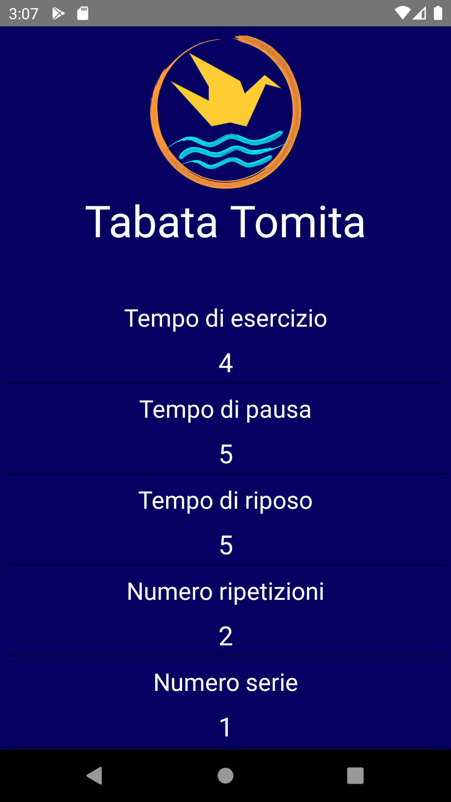
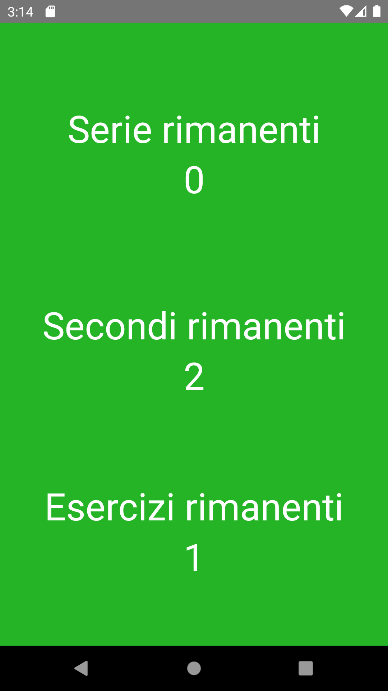
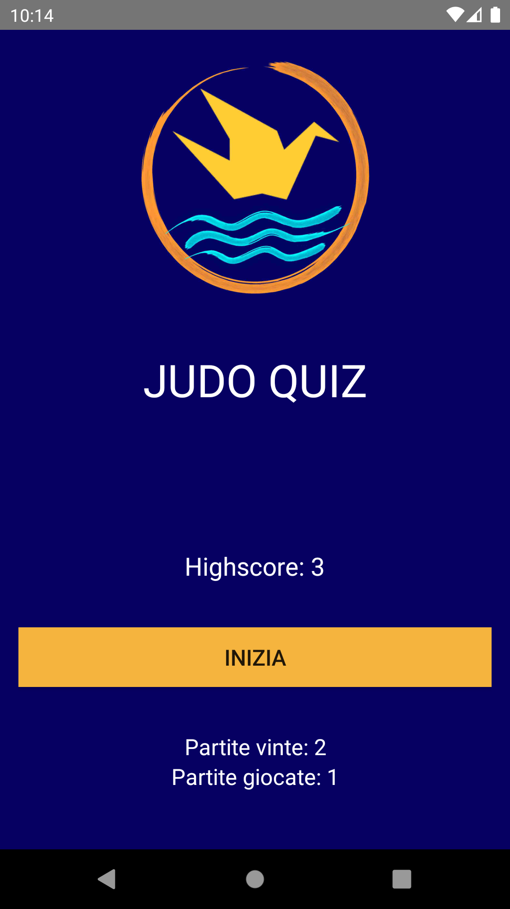
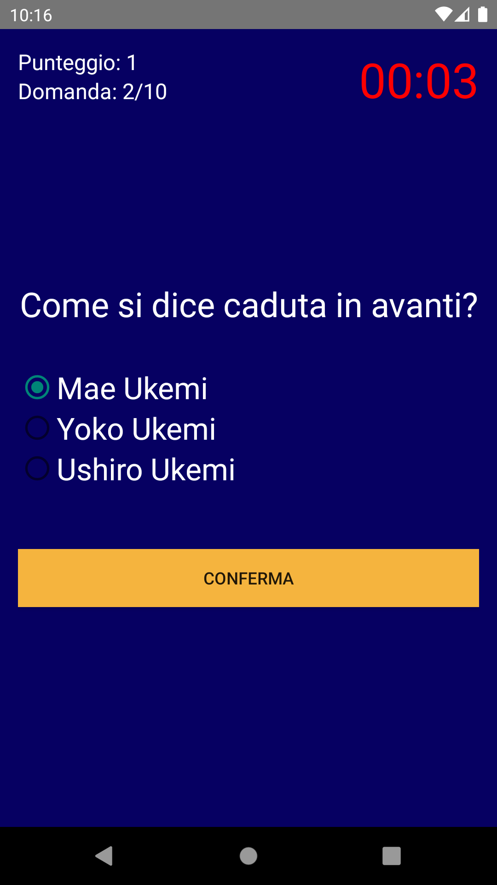
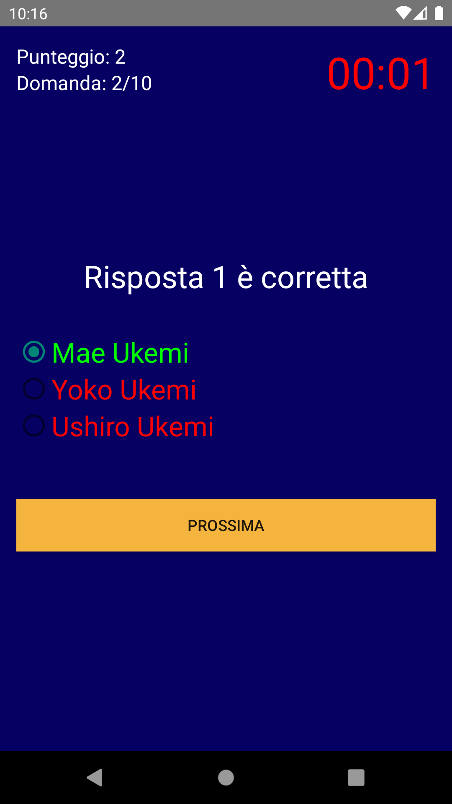

# Android Studio Projects
I have been studying app development in Android on my own. As of now I have launched three: 
- Tabata Tomita, for high intensity interval training.
- Judo Quiz, a short game about ten questions with multiple choice about judo.
- DiscoveRome, that is about nightlife but still in development.
 
## :zap:Tabata Tomita
Customizable Tabata timer for your ideal workout !!
- Exercise Time: duration time of each exercise.
- Pause time: pause time between one exercise and another.
- Rest time: rest time between one set of exercises and another.
- Number of repetitions: number of exercises to be done on each repetition.
- Number of sets: number of times you want to repeat the workout. 

It starts with a rest time to allow for proper warm-up. 
You can find it [here](https://play.google.com/store/apps/details?id=pippo.judoquiz).  

## :martial_arts_uniform:[Judo Quiz](https://play.google.com/store/apps/details?id=pippo.judoquiz)
Test your judo knowledge !!
More than 150 questions with 3 options each. 

Train your mind and knowledge on judo, with curiosity, Italian-Japanese and Japanese-Italian translations. 
The rules are simple, answer 10 questions correctly to get points. But be careful for each question there is a time limit !! And it is not worth looking on the internet.. 
You can find it [here](https://play.google.com/store/apps/details?id=pippo.judoquiz).  

## 🕺🏽DiscoveRome
Dedicated to those who don't know what to do in the evening; 
to those who always want to change places to have fun; 
to those who want to make new acquaintances; 
to those who want to go to the club playing their favorite music; 
but above all it is dedicated to all those who always want to party !!!!
Still under development.

## Information
The above material is being made for hobby: because of that everything is **uncommented**. 
If you wish to have the code, send me an [email](mailto:betello.1835108@studenti.uniroma1.it?subject=[GitHub_Android_Studio_projects]) specifing which app you want analize.

